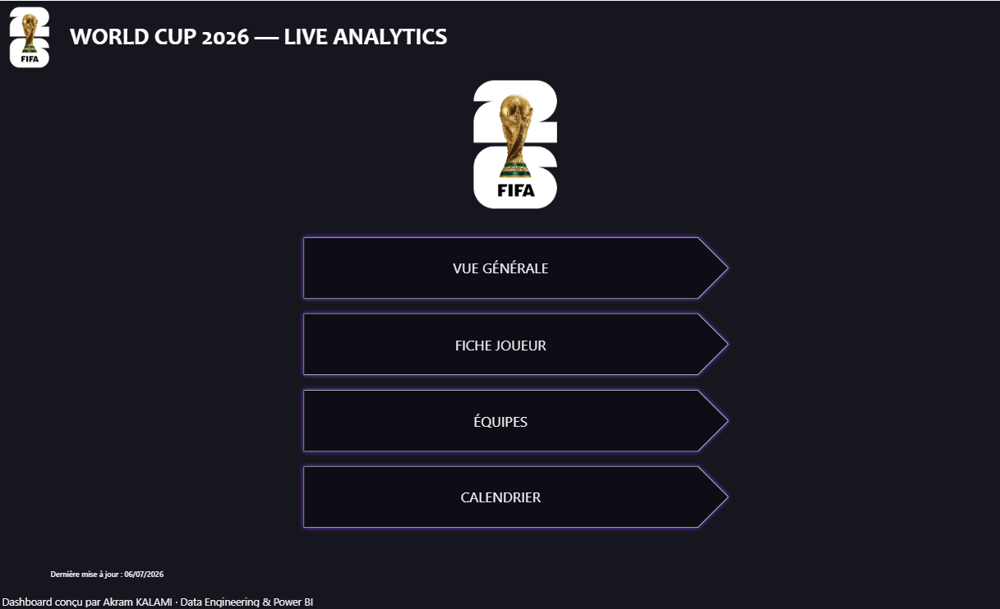
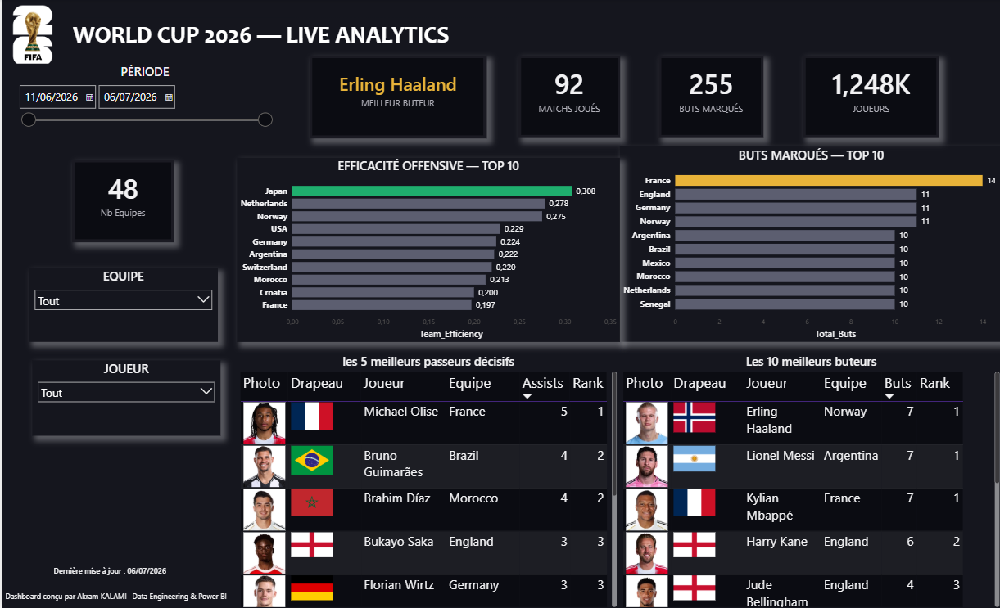
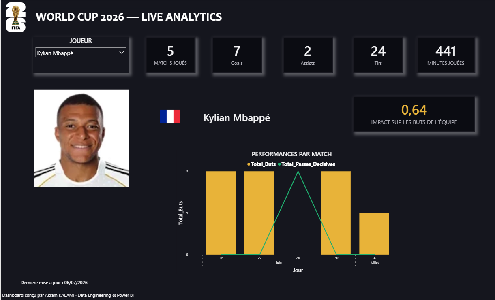
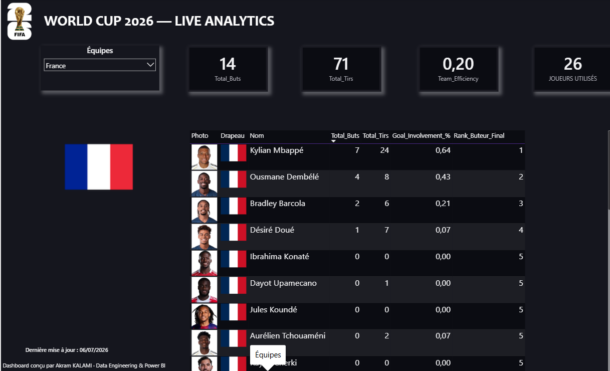
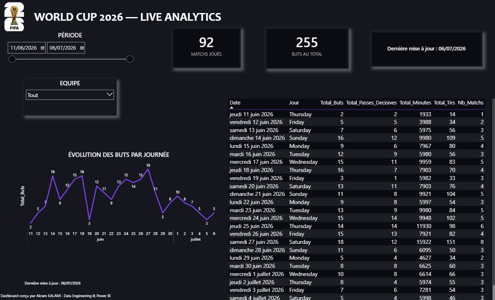

# 🏆 World Cup 2026 — Live Analytics Dashboard

> Dashboard Power BI temps réel pour la Coupe du Monde FIFA 2026 — pipeline Python → schéma en étoile → visualisations interactives avec DAX avancé.


---

## 📸 Aperçu

### Menu



### Vue Générale



### Fiche Joueur



### Équipes



### Calendrier



---

## 🎯 Ce que fait ce projet

Un dashboard 5 pages connecté à l'API officielle API-Football, rafraîchi automatiquement via GitHub Actions, alimentant un modèle en étoile Power BI avec des mesures DAX avancées et un design Dark Mode professionnel.

**Données en temps réel :**

- 92 matchs joués analysés
- 255 buts tracés
- 1 248 joueurs suivis
- 48 équipes avec drapeaux et logos dynamiques

---

## 🏗️ Architecture

```
API-Football
     │
     ▼
Python ETL (fetch_api_football.py)
     │
     ▼
Star Schema (build_star_schema.py)
     │
     ├── Dim_Joueurs    (1 248 lignes)
     ├── Dim_Equipes    (48 lignes)
     ├── Dim_Calendrier (dates, phases)
     └── Fact_Performances (grain : joueur × match)
     │
     ▼
Power BI Desktop (5 pages interactives)
```

---

## 🛠️ Stack technique

| Couche        | Technologie                                     |
| ------------- | ----------------------------------------------- |
| Acquisition   | Python 3.13 (`requests`, `pandas`, `pycountry`) |
| Source        | API-Football (plan Pro, saison 2026)            |
| Modélisation  | Schéma en étoile, colonnes RELATED()            |
| Mesures       | DAX avancé (RANKX, ALLSELECTED, REMOVEFILTERS)  |
| Visualisation | Power BI Desktop Dark Mode                      |
| CI/CD         | GitHub Actions (refresh toutes les 6h)          |

---

## 🧮 DAX Highlights

### Classement buteurs dynamique

```dax
Rank_Buteur_Final =
RANKX(
    ALLSELECTED(Dim_Joueurs),
    CALCULATE([Total_Buts]),
    , DESC, DENSE
)
```

### Impact joueur sur les buts d'équipe

```dax
Goal_Involvement_% =
VAR ButsEtPassesJoueur = [Total_Buts] + [Total_Passes_Decisives]
VAR EquipeActuelle = MAX(Dim_Equipes[Nom_Equipe])
VAR ButsEquipe = CALCULATE([Total_Buts], REMOVEFILTERS(Dim_Joueurs),
    Dim_Equipes[Nom_Equipe] = EquipeActuelle)
RETURN DIVIDE(ButsEtPassesJoueur, ButsEquipe, 0)
```

### Efficacité offensive

```dax
Team_Efficiency = DIVIDE([Total_Buts_Equipe], [Total_Tirs_Equipe], 0)
```

---

## 🚀 Setup

```bash
git clone https://github.com/mindhunter22/worldcup2026-dashboard.git
cd worldcup2026-dashboard
python -m venv .venv
.venv\Scripts\activate
pip install -r requirements.txt
cp .env.example .env  # puis renseigne API_FOOTBALL_KEY
python etl/fetch_api_football.py
python etl/build_star_schema.py api_football_players_stats.csv
```

Ouvre `dashboard/WorldCup2026.pbix` dans Power BI Desktop → **Actualiser**.

---

## ♻️ Refresh automatique

Le workflow `.github/workflows/refresh-data.yml` relance le pipeline toutes les 6h :

1. Push le repo sur GitHub
2. **Settings → Secrets → Actions → New secret** : `API_FOOTBALL_KEY`
3. Onglet **Actions → Run workflow** pour lancer manuellement

---

## ⚠️ Note sur le xG

Le xG n'est plus disponible gratuitement pour la CdM 2026 (Stats Perform est devenu fournisseur exclusif FIFA). `Team_Efficiency` utilise le taux de conversion Buts/Tirs en remplacement — un indicateur tout aussi pertinent sur la qualité de finition.

---

## 👤 Auteur

**Akram KALAMI** — Data Engineering & Power BI  
Master EISI · EPSI Grenoble · Alternance Caterpillar France

[](https://www.linkedin.com/in/akram-kalami-80920024b)
[](https://github.com/mindhunter22)

---

_Juin–Juillet 2026 · Projet portfolio · Données : API-Football_
