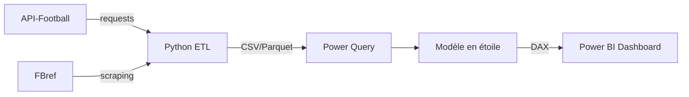

# 🏆 World Cup 2026 — Live Analytics Dashboard

Dashboard Power BI temps réel pour suivre la Coupe du Monde FIFA 2026 : performances joueurs, classements dynamiques, et indicateurs avancés (xG, Goal Involvement).

  

---

## 🎯 Aperçu

Un dashboard en Dark Mode connecté à l'API-Football, alimentant un modèle en étoile avec rendu d'images natif (portraits joueurs, logos, drapeaux) et des mesures DAX avancées (classement dynamique, efficacité offensive vs xG).

## 🏗️ Architecture



## 🛠️ Stack technique

| Couche | Technologie |
|---|---|
| Acquisition | Python (`requests`, `BeautifulSoup`, `pandas`) |
| Source temps réel | API-Football |
| Source complémentaire | FBref (scraping throttlé) |
| Modélisation | Power Query + schéma en étoile |
| Visualisation | Power BI (DAX, thème custom Dark Mode) |
| Automatisation | GitHub Actions (refresh planifié) |

## 📊 Modèle de données

- `Fact_Performances` — grain : joueur × match
- `Dim_Joueurs` — inclut `URL_Photo` (catégorie de données : URL d'image)
- `Dim_Equipes` — inclut `URL_Logo`, `URL_Drapeau`
- `Dim_Calendrier` — phases de compétition (Groupes → Finale)

## 🧮 DAX highlights

- `Rank_Buteur` — classement buteurs qui s'adapte aux filtres (pays, phase) via `ALLSELECTED`
- `Goal_Involvement_%` — part des buts d'équipe impliquant le joueur via `ALLEXCEPT`
- `Team_Efficiency` — performance réelle vs Expected Goals (xG)

## 🚀 Setup

```bash
git clone https://github.com/votre-user/worldcup2026-dashboard.git
cd worldcup2026-dashboard
pip install -r requirements.txt
python etl/fetch_data.py
```

Ouvrir `dashboard/WorldCup2026.pbix` dans Power BI Desktop, mettre à jour la source de données vers le CSV/Parquet généré.

## 📸 Aperçu du dashboard

> _Screenshot à insérer ici_

## 📄 Licence

MIT

---

*Projet personnel — données publiques (API-Football / FBref), à but de démonstration technique.*
